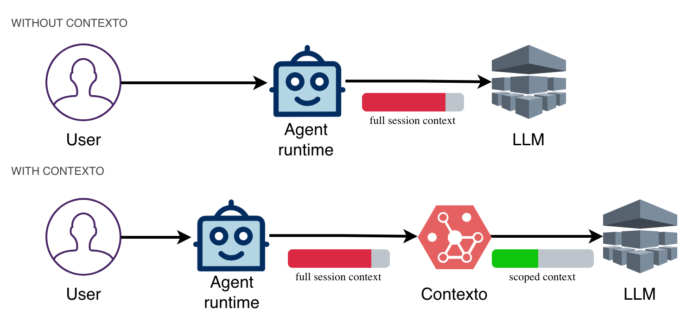

<h1 align="center">Contexto</h1>
<h2 align="center">Keep long-running OpenClaw agents reliable after the context window fills.</h2>
<p align="center">A drop-in OpenClaw context engine that retrieves old constraints instead of losing them to summaries.</p>

<p align="center">
  <a href="#quick-start">Quick Start</a>&nbsp;&nbsp;&bull;&nbsp;&nbsp;
  <a href="#why-contexto">Why Contexto</a>&nbsp;&nbsp;&bull;&nbsp;&nbsp;
  <a href="#how-it-works">How It Works</a>&nbsp;&nbsp;&bull;&nbsp;&nbsp;
  <a href="https://getcontexto.com/">Website</a>&nbsp;&nbsp;&bull;&nbsp;&nbsp;
  <a href="https://discord.gg/4QTRS5ew">Discord</a>
</p>

<p align="center">
  <a href="https://github.com/ekailabs/contexto"></a>&nbsp;
  <a href="https://www.npmjs.com/package/@ekai/contexto"></a>&nbsp;
  <a href="https://opensource.org/licenses/Apache-2.0"></a>&nbsp;
  <a href="https://discord.gg/4QTRS5ew"></a>
</p>

<p align="center">
  OpenClaw works well until long sessions start compacting away the exact instruction that mattered.<br />
  Contexto is the context engine built for that failure mode.
</p>

## The Problem in 15 Seconds

<table>
<tr>
<td width="50%">

**Without Contexto**

```text
Turn 2:
"Flag suspicious emails.
Do NOT delete anything."

[... 30 more turns:
tools, retries, compaction ...]

Turn 35: Agent deletes 12 flagged emails.
The constraint was lost in summarization.
```

</td>
<td width="50%">

**With Contexto**

```text
Turn 35: Agent flags 4 new suspicious emails.

Retrieved context:
  -> user constraint: flag only, never delete

The instruction survives compaction.
```

</td>
</tr>
</table>

## Why Contexto

Contexto is a context engine for OpenClaw. It is built for the exact moment OpenClaw starts dropping or blurring the context your agent still needs:

- early instructions get compacted away
- summaries turn into summaries of summaries
- unrelated topics blur together
- the agent becomes less reliable the longer you use it

Contexto fixes that by storing full episodes and retrieving only the context that is relevant right now.

## What You Get

- Keeps important constraints retrievable even after long sessions and compaction
- Stores full episodes instead of collapsing everything into lossy summaries
- Separates topics with semantic clustering so retrieval stays clean
- Surfaces explainable paths such as `travel -> Japan -> visa docs`
- Drops into OpenClaw as one plugin with one config key

## Quick Start

Built for OpenClaw today. Managed hosting is available, so you do not need to run retrieval infrastructure yourself.

```bash
openclaw plugins install @ekai/contexto
openclaw plugins enable contexto
openclaw config set plugins.slots.contextEngine contexto
openclaw config set plugins.entries.contexto.config.apiKey YOUR_KEY
openclaw gateway restart
```

Get an API key at [getcontexto.com](https://getcontexto.com/).

If your agent ever forgets a rule, preference, or prior decision after a long run, this is the switch to try first.

## Who Should Use This

- OpenClaw users whose sessions run long enough to compact
- Agents where forgotten constraints are costly
- Teams that want better reliability without prompt hacks
- Not for one-shot chats or very short sessions

## How Contexto Compares

If you are deciding whether this is worth installing, this is the short version.

| | Default OpenClaw | **Contexto** |
|---|---|---|
| **When the context window fills** | Older turns get compacted into a summary entry; recent messages stay intact | Full episodes get ingested and indexed |
| **Keeps earlier instructions?** | Degrades over time | Yes, original episodes remain retrievable |
| **Keeps topics separated?** | No, unrelated topics get blurred together | Yes, semantic clustering keeps branches distinct |
| **Can you explain what was retrieved?** | No | Yes, full path tracing (`travel -> Japan -> visa docs`) |
| **Setup time** | Built-in | One plugin install, one config key |

<p align="center">
  
</p>

## How It Works

Contexto turns aging conversation history into a searchable context tree instead of a lossy summary blob.

1. OpenClaw buffers conversation turns as full episodes.
2. When the prompt budget crosses the compaction threshold, the oldest episodes are ingested.
3. Episodes are clustered with hierarchical similarity, so related work lands in the same branch.
4. Retrieval uses beam search to pull back the most relevant episodes for the current prompt.

That means old context is not gone. It is organized.

### Under the Hood

- **Episodes and sliding window**: the storage unit is a full turn, including tool output.
- **Hierarchical clustering (AGNES)**: related episodes are grouped without predefined categories.
- **Multi-branch beam search**: retrieval can pull from several relevant branches in one pass.
- **Hybrid rebuild strategy**: periodic full rebuilds plus cheaper incremental inserts between them.

For the deeper technical reasoning:

- [Fixing Context Collapse in Long-Running Agents](https://getcontexto.com/blogs/contexto-mindmap)
- [Your AI Agent Isn't Broken. It's Missing the Context Engine](https://getcontexto.com/blogs/context-engine)
- [Why We Chose Hierarchical Clustering](https://github.com/ekailabs/contexto/discussions/114)

## Configuration

| Property | Type | Required | Default | Description |
| --- | --- | --- | --- | --- |
| `apiKey` | string | Yes | — | Your Contexto API key |
| `contextEnabled` | boolean | No | `true` | Enable or disable context injection |
| `maxContextChars` | number | No | — | Max characters for injected context |
| `compactThreshold` | number (0-1) | No | `0.50` | Ingest and evict at this share of token budget |
| `compactionStrategy` | `'sliding-window' \| 'default'` | No | `'default'` | Compaction strategy |

## Custom Backends

The engine talks to storage through `ContextoBackend`. The default remote backend calls `api.getcontexto.com`, but you can implement your own.

```ts
interface ContextoBackend {
  ingest(payload: WebhookPayload | WebhookPayload[]): Promise<void>;
  search(
    query: string,
    maxResults: number,
    filter?: Record<string, unknown>,
    minScore?: number
  ): Promise<SearchResult | null>;
}
```

## Roadmap

- [ ] Horizontal scaling with sub-agent context delegation
- [ ] Scoped context with access boundaries
- [ ] Knowledge from external documents
- [ ] Local backend
- [ ] Context sharing across agents

## Community

- [Discord](https://discord.gg/4QTRS5ew)
- [Discussions](https://github.com/ekailabs/contexto/discussions)
- [Issues](https://github.com/ekailabs/contexto/issues)
- [Contributing guide](CONTRIBUTING.md)

## License

Apache 2.0. See [LICENSE](LICENSE).

---

<p align="center">
  If long-session reliability matters to you, star the repo and help other OpenClaw users discover it.
</p>
